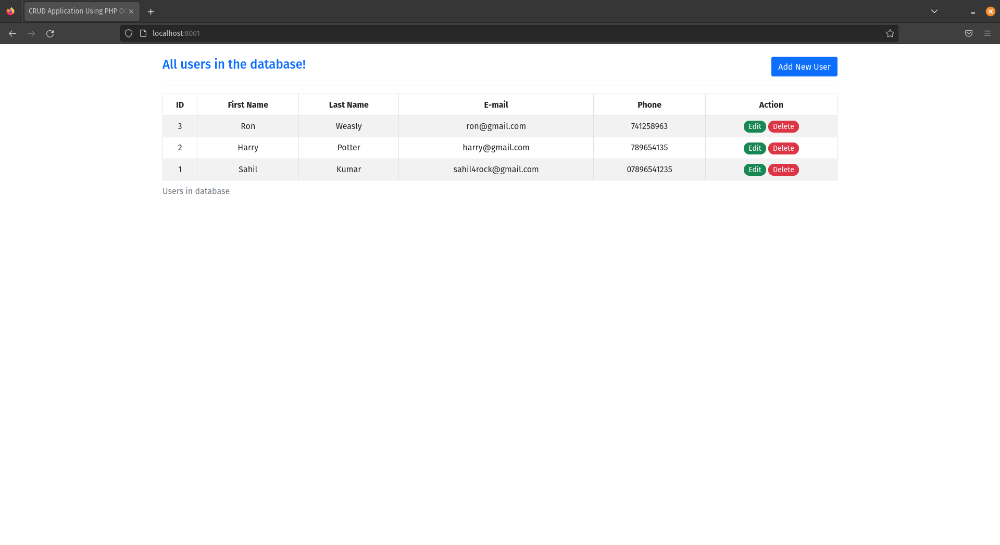
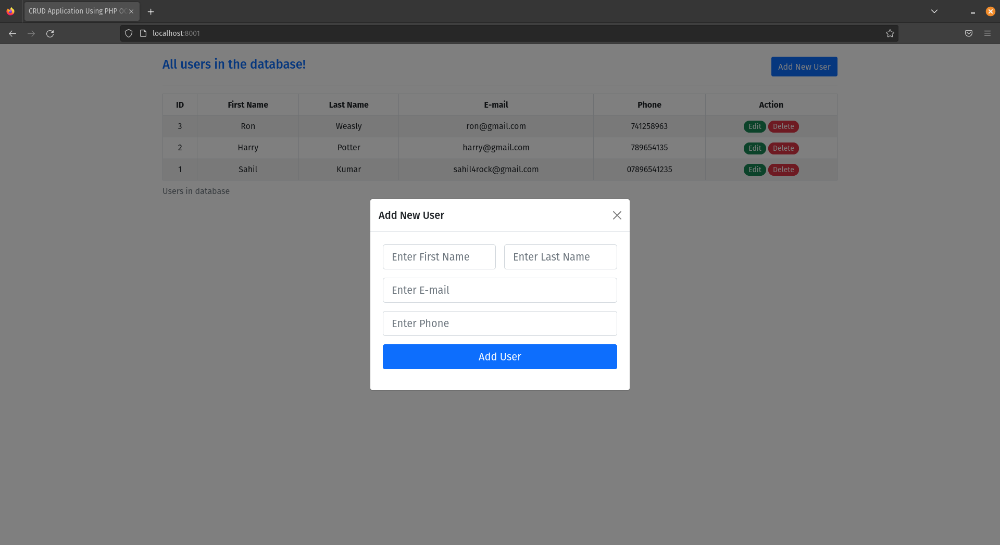
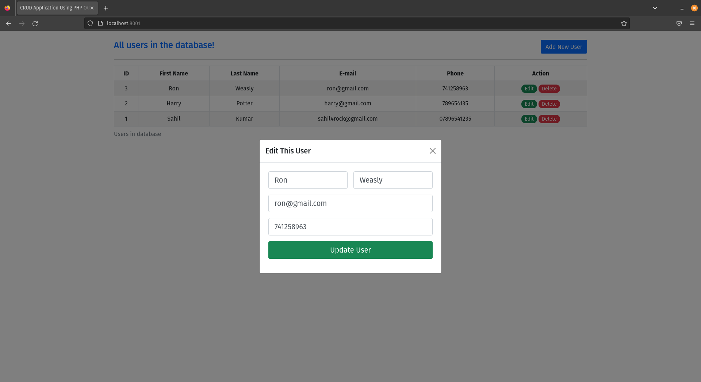
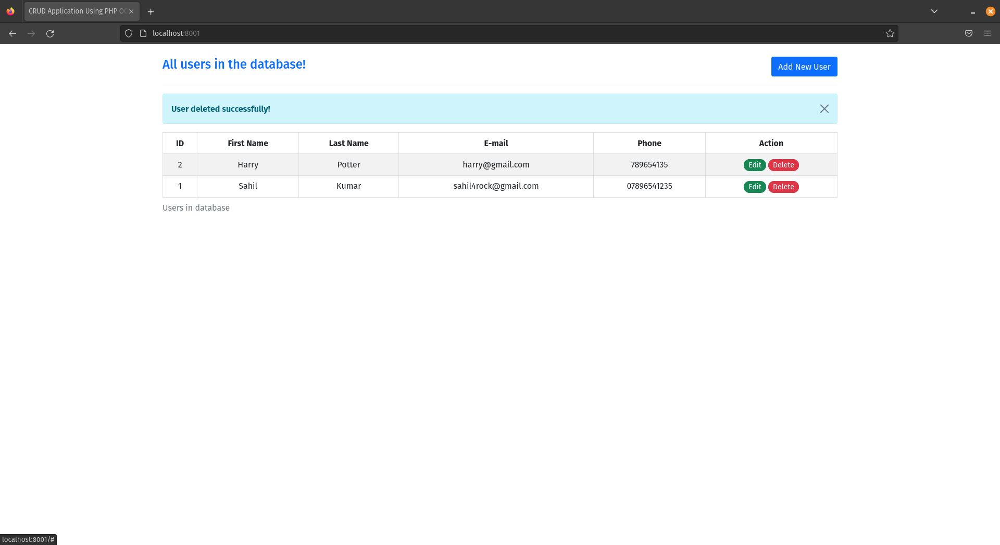

# Webapp crud<!-- omit from toc -->

Exemplo de aplicação usando LAMP (Linux, Apache, MySQL, PHP) com um simples CRUD (Create, Read, Update e Delete).

## Tabela de Conteúdos<!-- omit from toc -->

- [Features](#features)
- [Telas da aplicação](#telas-da-aplicação)
- [Como usar](#como-usar)
- [Tecnologias usadas](#tecnologias-usadas)
- [Fontes](#fontes)
- [Licença](#licença)
- [Autor](#autor)

## Features

- [x] CRUD de usários usando a pilha LAMP

## Telas da aplicação

**Tela inicial**

**Novo usuário**

**Atualizar dados**

**Excluir usuário**

## Como usar

É necessário ter o Docker e o Docker Compose instalados na sua máquina.

* [Instalação do Docker](https://docs.docker.com/engine/install/)
* [Instalação do Docker Compose](https://docs.docker.com/compose/install/)

Já tendo ambos, basta apenas rodar o comando `docker compose up -d` para subir a aplicação.

Os links para acesso são:

* [Aplicação](http://localhost:8001/)
* [PHP Myadmin](http://localhost:8000/)

## Tecnologias usadas

- Docker
- Docker Compose
- Pilha LAMP (Linux, Apache, MySQL e PHP)

## Fontes

FERREIRA, Micael. Criando uma imagem LAMP no Docker - Comunidade Vale Livre - Medium. Medium. Disponível em: <https://medium.com/comunidade-vale-livre/criando-uma-imagem-lamp-no-docker-be74536866a9>.

KUMAR, Sahil. CRUD App Using Bootstrap 5, PHP-OOP, PDO-MySQL, Fetch API of ES6. DCodeMania. Disponível em: <https://dcodemania.com/post/crud-app-php-oop-pdo-mysql-fetch-api-es6>.
‌
## Licença

[Apache License Version 2.0](https://www.apache.org/licenses/LICENSE-2.0)

## Autor

    
    
Feito por Gustavo Silva:

    
    
     
    
    

